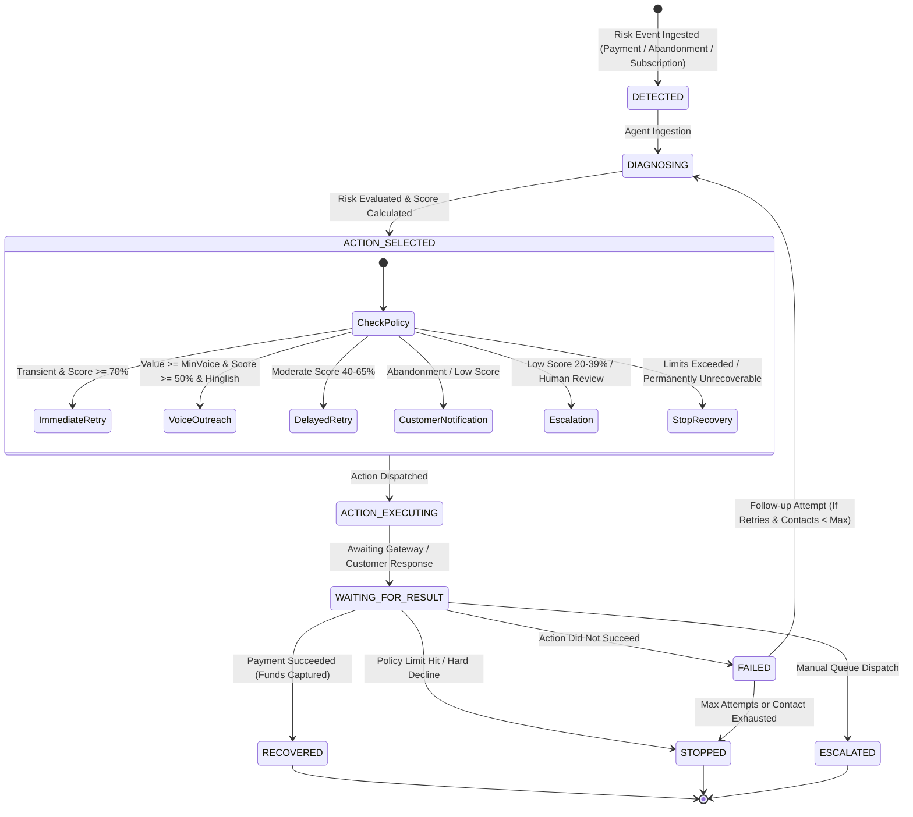
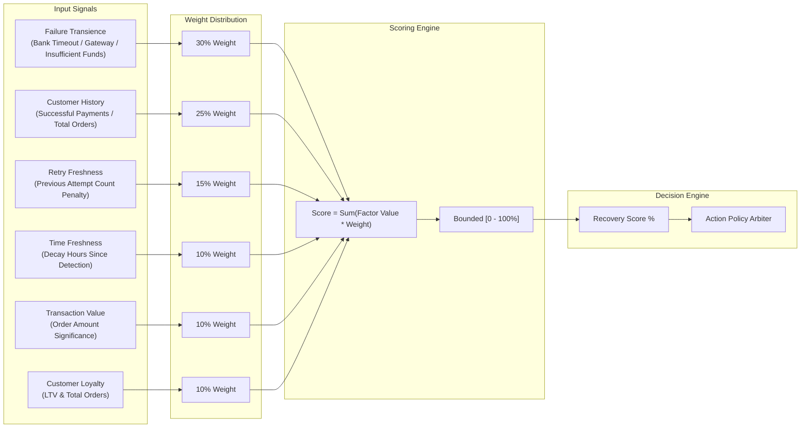
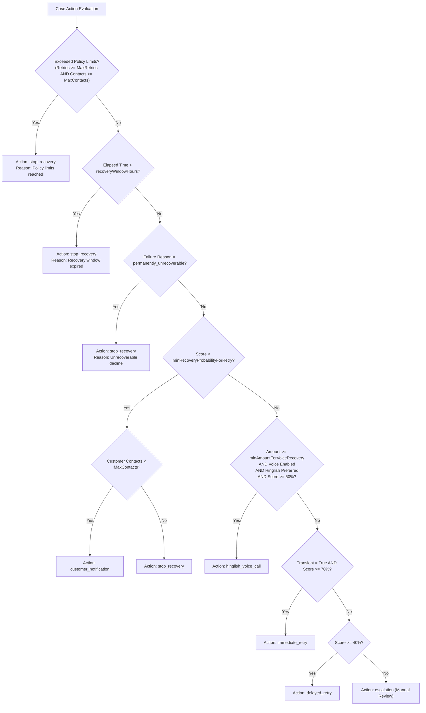
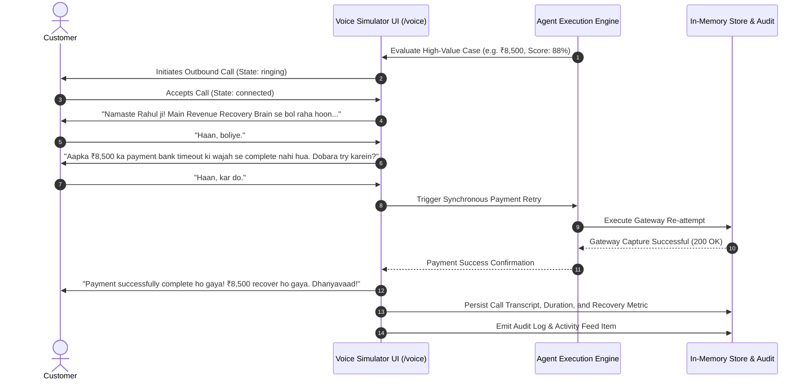
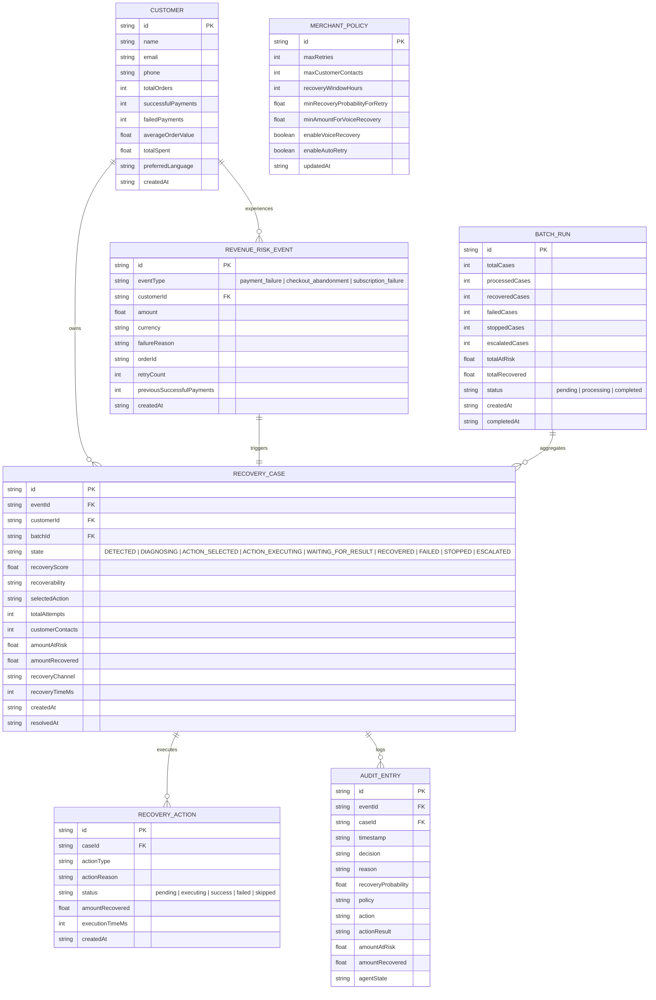
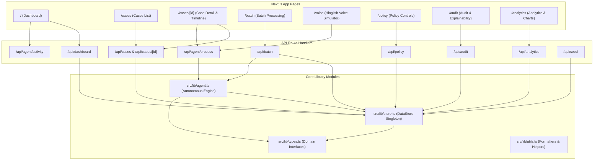

# Revenue Recovery Brain — System Architecture

**Revenue Recovery Brain** is an autonomous, event-driven AI revenue recovery orchestration platform designed for e-commerce, D2C, fintech, and subscription merchants. It intercepts failed payments, checkout abandonments, and subscription churn events, diagnoses root causes, scores recoverability using multi-factor probability models, and executes policy-governed interventions (intelligent retries, personalized customer notifications, and Hinglish voice outreach) with explainable audit trails.

---

## 1. High-Level System Architecture

The application is architected as a full-stack Next.js 16 application featuring an autonomous agent loop, an in-memory transactional datastore, and a real-time reactive user interface.

```mermaid
flowchart TB
    subgraph ClientLayer["Frontend Presentation Layer (Next.js 16 + React 19)"]
        UI_Dash["Dashboard (/)"]
        UI_Cases["Case Management (/cases & /cases/[id])"]
        UI_Batch["Batch Runner Studio (/batch)"]
        UI_Voice["Hinglish Voice Recovery Simulator (/voice)"]
        UI_Policy["Merchant Policy Rules (/policy)"]
        UI_Audit["Explainability & Audit Trail (/audit)"]
        UI_Analytics["Revenue & Channel Analytics (/analytics)"]
    end

    subgraph APILayer["API Routing & Controllers (Next.js App Router)"]
        API_Agent["/api/agent/process & /api/agent/activity"]
        API_Cases["/api/cases & /api/cases/[id]"]
        API_Batch["/api/batch"]
        API_Dash["/api/dashboard"]
        API_Policy["/api/policy"]
        API_Audit["/api/audit"]
        API_Analytics["/api/analytics"]
        API_Seed["/api/seed"]
    end

    subgraph AgentCore["Autonomous Recovery Agent Engine (src/lib/agent.ts)"]
        Diag["1. Diagnosis Engine (analyzeRevenueRisk)"]
        CustCtx["2. Customer Context Resolver (getCustomerContext)"]
        Scorer["3. Multi-Factor Scoring Engine (calculateRecoveryScore)"]
        PolicyArb["4. Policy Arbiter & Action Selector (selectRecoveryAction)"]
        ExecEng["5. Action Execution Engine (executeRecoveryAction)"]
        Auditor["6. Audit & Explainability Logger (recordAuditEvent)"]
        ActivityEng["7. Live Activity Feed Generator (recordActivity)"]
    end

    subgraph DataLayer["Persistence & In-Memory Datastore (src/lib/store.ts)"]
        Store_Events[("Risk Events Map")]
        Store_Customers[("Customer Profiles Map")]
        Store_Cases[("Recovery Cases Map")]
        Store_Actions[("Recovery Actions Map")]
        Store_Batches[("Batch Runs Map")]
        Store_Audit[("Audit Log Array")]
        Store_Feed[("Activity Feed Array")]
        Store_Policy[("Merchant Policy Config")]
    end

    ClientLayer <-->|HTTP / REST API| APILayer
    APILayer <-->|Invoke Pipeline & Fetch State| AgentCore
    AgentCore <-->|CRUD & State Transitions| DataLayer
    APILayer <-->|Direct Read Queries| DataLayer
```

---

## 2. Autonomous Agent Lifecycle & State Machine

The recovery engine follows a 7-step autonomous lifecycle. When a risk event enters the system, it transitions through well-defined lifecycle states governed by merchant policies.

### State Machine Transition Rules

| State | Description | Next Allowed States | Exit Conditions |
| :--- | :--- | :--- | :--- |
| `DETECTED` | Initial event ingestion (payment failure, checkout abandonment, recurring billing error). | `DIAGNOSING` | Case initialized and enqueued for agent evaluation. |
| `DIAGNOSING` | The failure reason, error category, and transience are parsed. | `ACTION_SELECTED` | Diagnosis result generated and recoverability classified. |
| `ACTION_SELECTED` | The multi-factor score is computed and matched against merchant policy. | `ACTION_EXECUTING` | Action selected (retry, call, notification, escalate, stop). |
| `ACTION_EXECUTING` | The intervention is dispatched via payment gateway, telephony, or messaging. | `WAITING_FOR_RESULT` | Gateway / channel execution call submitted. |
| `WAITING_FOR_RESULT` | System monitors execution feedback or customer payment webhook. | `RECOVERED`, `FAILED`, `STOPPED`, `ESCALATED` | Response received or timeout elapsed. |
| `RECOVERED` | Terminal state. Funds successfully captured and verified. | `[*]` | Revenue credited; audit trail finalized. |
| `FAILED` | Intermediate failure state. Agent triggers fallback evaluation. | `DIAGNOSING`, `STOPPED` | Policy permits follow-up or triggers termination. |
| `STOPPED` | Terminal state. Recovery abandoned due to policy limits or hard decline. | `[*]` | Prevents further retries or customer spam. |
| `ESCALATED` | Terminal state. Handed off to human merchant operations queue. | `[*]` | Edge cases requiring manual intervention. |

---

## 3. Decision-Making & Multi-Factor Scoring Engine

Before selecting any intervention, the agent evaluates the transaction using an algorithmic multi-factor scoring model that outputs a **Recovery Probability Score (0–100%)**.

### Mathematical Factor Weights

$$\text{Recovery Score} = \sum_{i=1}^{6} (\text{Value}_i \times \text{Weight}_i)$$

1. **Failure Transience ($30\%$)**:
   - Transient network/gateway/bank timeouts = $95$ pts
   - Insufficient funds = $50$ pts
   - Expired cards = $20$ pts
   - Hard declines = $15$ pts
2. **Customer Historical Success Rate ($25\%$)**:
   - Ratio of past successful payments to total lifetime orders ($\% \times 0.25$).
3. **Retry Freshness ($15\%$)**:
   - Penalizes repeated failures: $\max(0, 100 - (\text{retryCount} \times 40))$.
4. **Time Freshness ($10\%$)**:
   - Accounts for lead decay: $\max(0, 100 - (\text{hoursSinceFailure} \times 3))$.
5. **Transaction Value Relevance ($10\%$)**:
   - Balances urgency for higher ticket sizes: $\min(100, (\text{amount} / 5000) \times 60 + 40)$.
6. **Customer Loyalty ($10\%$)**:
   - Rewards repeat, high-LTV customers: $\min(100, \text{totalOrders} \times 8 + (\text{totalSpent} > 50000 \,?\, 20 : 0))$.

---

## 4. Merchant Policy & Governance Guardrails

The engine operates under strict merchant-configured guardrails to ensure customer protection, spam prevention, and compliance with banking standards.

### Configurable Merchant Policy Parameters

| Policy Parameter | Default | Purpose & Guardrail |
| :--- | :--- | :--- |
| `maxRetries` | `2` | Maximum automated payment gateway retry attempts per case. |
| `maxCustomerContacts` | `2` | Maximum direct notifications/calls to prevent customer harassment. |
| `recoveryWindowHours` | `48` | Time-to-live (TTL) for automated recovery eligibility. |
| `minRecoveryProbabilityForRetry` | `65%` | Minimum score threshold required to trigger automated gateway retries. |
| `minAmountForVoiceRecovery` | `₹2,000` | Minimum order value required to initiate a conversational voice recovery call. |
| `enableVoiceRecovery` | `true` | Master toggle for conversational Hinglish voice agent. |
| `enableAutoRetry` | `true` | Master toggle for autonomous background gateway retries. |

---

## 5. Conversational Hinglish Voice Recovery Architecture

For high-value transactions and cart abandonments in the Indian market, the platform deploys an interactive voice recovery agent speaking natural **Hinglish** (Hindi + English blend).

---

## 6. Relational Entity-Relationship Diagram (ERD)

The data layer is structured around an in-memory transactional datastore supporting relational references and query indices.

---

## 7. Component & Route Architecture

The frontend is organized into modular views connected to backend REST API endpoints:

### Module Responsibilities

1. **[`src/lib/agent.ts`](file:///d:/revenue-recovery-brain/src/lib/agent.ts)**:
   - Contains pure and transactional agent functions: `analyzeRevenueRisk`, `calculateRecoveryScore`, `selectRecoveryAction`, `executeRecoveryAction`, and `processRecoveryCase`.
   - Implements the complete policy verification and decision audit trail generation.
2. **[`src/lib/store.ts`](file:///d:/revenue-recovery-brain/src/lib/store.ts)**:
   - Singleton `DataStore` pattern holding fast in-memory Maps for cases, events, customers, actions, batches, and audit records.
   - Includes realistic seed data tailored for Indian commerce (INR currency, Hinglish speakers, realistic UPI/card failure patterns).
3. **[`src/lib/types.ts`](file:///d:/revenue-recovery-brain/src/lib/types.ts)**:
   - Strongly typed TypeScript domain models, enums for recovery states, failure categories, and agent execution results.
4. **[`src/lib/utils.ts`](file:///d:/revenue-recovery-brain/src/lib/utils.ts)**:
   - INR currency formatting (`₹X,XX,XXX`), relative timestamps, and visual status badge styling helpers.

---

## 8. Security, Compliance & Explainability Standards

1. **No Black-Box Decisions**:
   - Every single transition records an `AuditEntry` detailing the exact mathematical score breakdown, merchant policy thresholds in effect at runtime, and textual reasoning.
2. **Contact Fatigue Prevention**:
   - Customer contacts are strictly capped via `maxCustomerContacts` to prevent spam, brand erosion, and telemarketing regulatory violations.
3. **Gateway Protection**:
   - Enforces exponential backoff and maximum retry caps (`maxRetries`) to prevent issuing bank velocity blocks and gateway penalties.
4. **Data Isolation**:
   - Case records maintain immutable links between original risk events, actions taken, and final capture confirmations.
